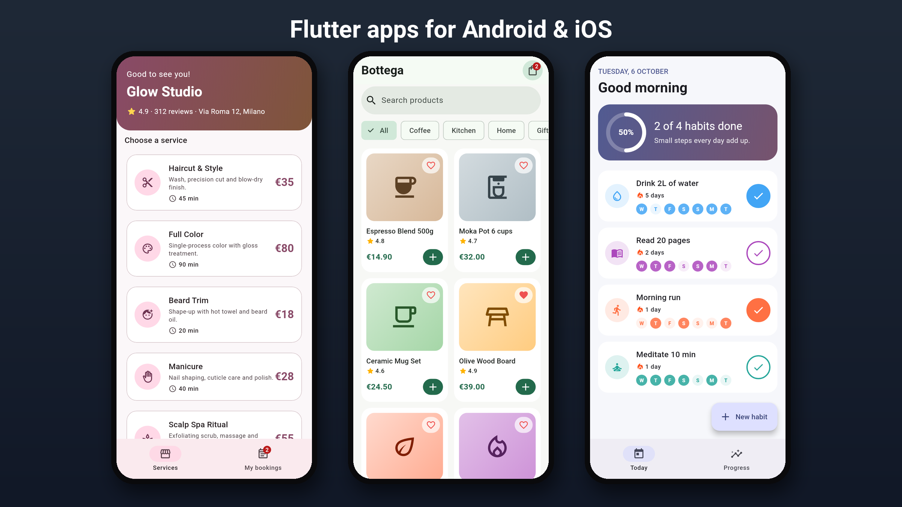
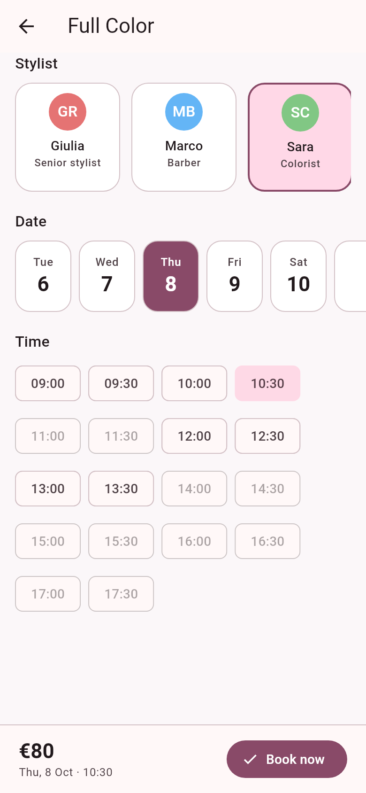
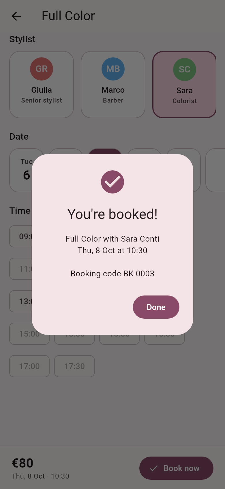
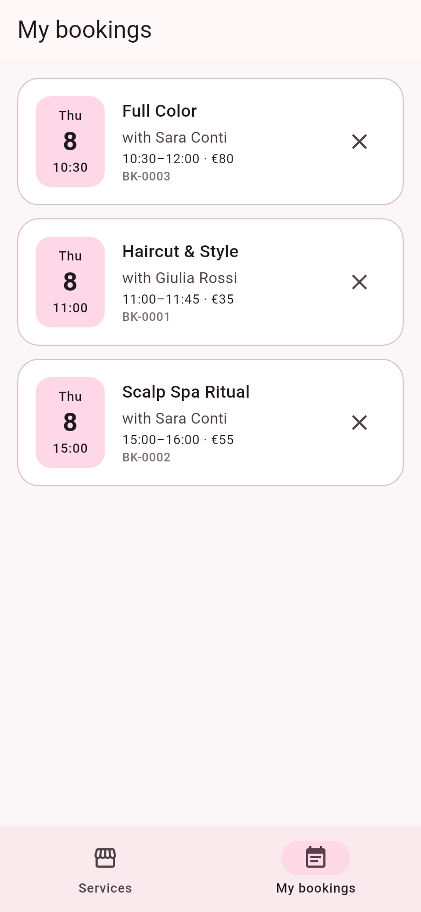
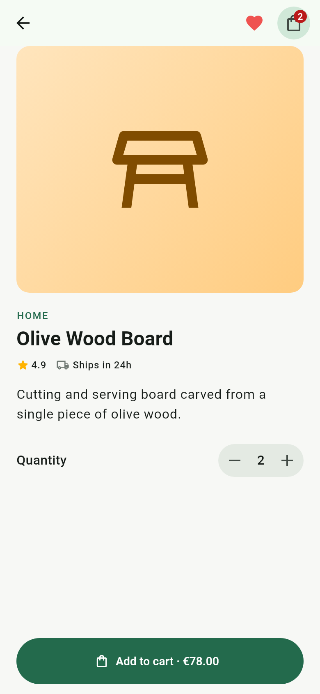
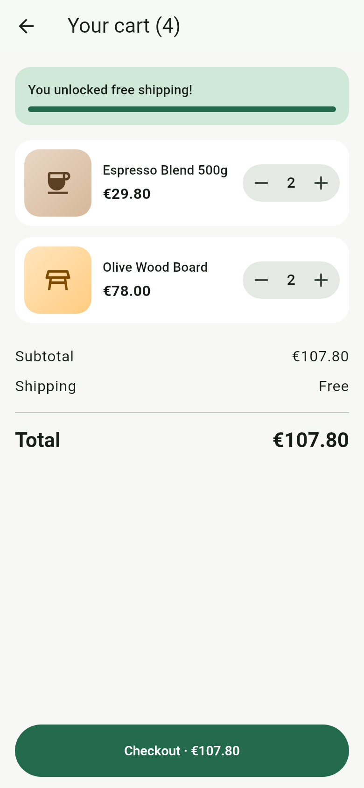
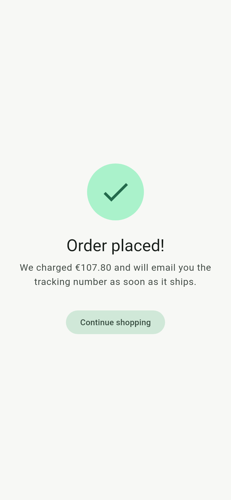
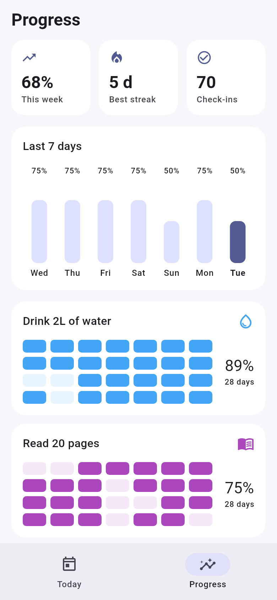
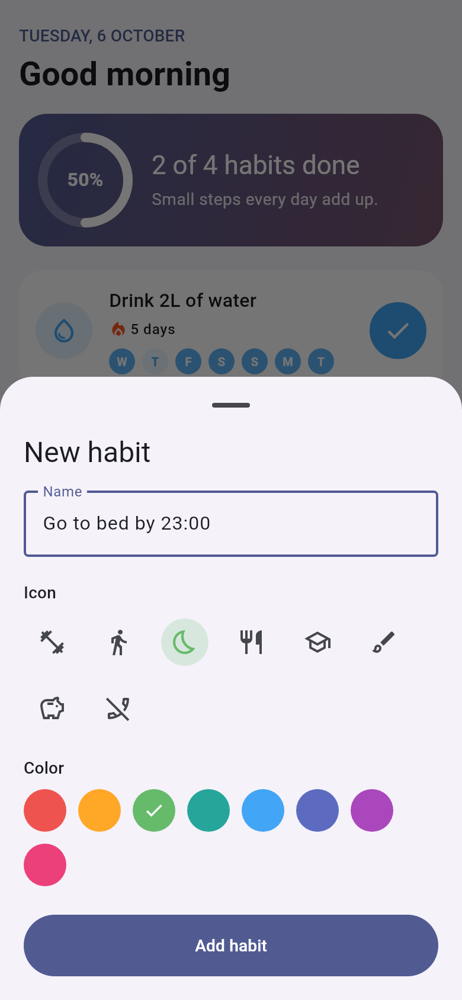

# Flutter App Portfolio



Three small, production-style mobile apps built with **Flutter** (one codebase for Android, iOS and web).
Each one shows a type of app clients ask for most often, with clean Material 3 design, tested business logic and no paid services required to run it.

| App | What it shows | Folder |
|---|---|---|
| **Glow Studio** – appointment booking | Service catalog, stylist and date picker, live time-slot availability, booking confirmation, cancel flow | [`apps/booking_app`](apps/booking_app) |
| **Bottega** – online shop | Product grid with search and categories, product page, favorites, cart with quantities, free-shipping progress, checkout | [`apps/shop_app`](apps/shop_app) |
| **Streaks** – habit tracker | Daily check-ins, streaks, weekly chart, 28-day heatmaps, create-a-habit sheet | [`apps/habit_tracker`](apps/habit_tracker) |

## Glow Studio – appointment booking

For salons, barbers, clinics, personal trainers: any business that sells time slots.

| Services | Pick a slot | Confirmation | My bookings |
|---|---|---|---|
|  |  |  |  |

- Slots respect opening hours, the length of each service and the stylist's existing bookings, so double bookings are impossible.
- Sundays are closed, past times are disabled, and every booking gets a code.

## Bottega – online shop

For small brands and local shops that want their own app instead of a marketplace listing.

| Catalog | Product | Cart | Order placed |
|---|---|---|---|
|  |  |  |  |

- Live search and category filters, favorites, a cart badge that updates everywhere.
- The cart computes subtotal, shipping and a free-shipping threshold; checkout is one tap.

## Streaks – habit tracker

For wellness, fitness and productivity ideas, the kind of app people build with AI tools and then need help finishing.

| Today | Progress | New habit |
|---|---|---|
|  |  |  |

- One tap to complete a habit; streaks and the weekly chart update instantly.
- Custom habits with icon and color, long-press to delete.

## How the code is organized

Every app follows the same simple structure, easy for another developer (or the client) to pick up:

```
apps/<app>/
  lib/main.dart          app entry point and theme
  lib/src/               models, state (ChangeNotifier) and helpers
  lib/src/screens/       one file per screen
  test/widget_test.dart  unit and widget tests
```

- **State management:** `ChangeNotifier` + `InheritedNotifier`, no third-party packages, so it can move to Provider, Riverpod or Bloc in minutes.
- **Backend-ready:** data lives in one store class per app, the single place to plug in Firebase or a REST API.
- **CI:** every push runs format check, `flutter analyze` and the tests for all three apps ([workflow](.github/workflows/flutter.yml)).

## Run an app

```bash
cd apps/booking_app        # or shop_app, habit_tracker
flutter pub get
flutter run                # Android emulator, iOS simulator or Chrome
flutter test
```

Screenshots are generated from the real app code by `tool/screenshots.sh`.

## Need an app like these?

I build, fix and publish Flutter apps, including apps started with AI tools (FlutterFlow, Cursor, Lovable, ChatGPT code) that don't quite work yet.
Get in touch through my Fiverr profile.
